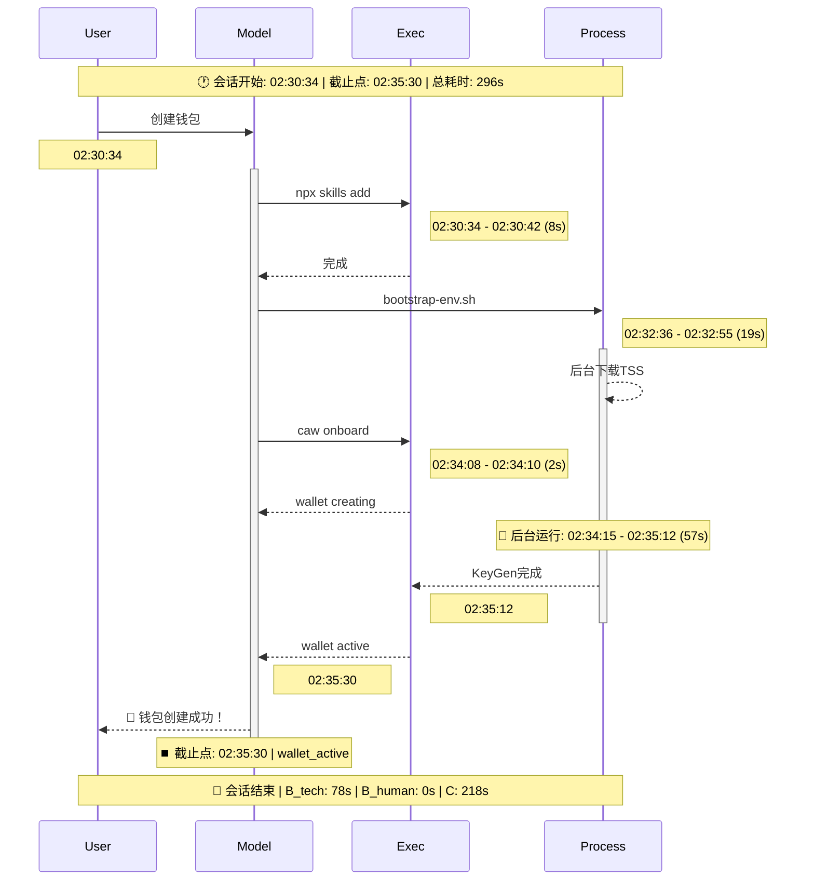

# OpenClaw Session 分析 Skill

分析钱包创建会话，输出**可视化 Markdown 报告**，通过 Mermaid 图表和详细时间线表格，一眼看出耗时瓶颈（>10s标红）。

---

## Agent 速览（执行步骤）

### 第一步：找文件

**方式A - 自动查找最新钱包会话（推荐）**
```bash
# 列出所有sessions，按修改时间排序，取最新的
ls -lt ~/.openclaw/agents/main/sessions/*.jsonl | head -5
```

**方式B - 手动指定**
- 用户直接提供会话文件路径
- 或导出到指定目录后分析

**方式C - 自动导出原始会话（标准流程，必做）**
```bash
# 分析前自动导出原始文件（用于TG双发和人工复核）
latest=$(ls -t ~/.openclaw/agents/main/sessions/*.jsonl | head -1)
cp "$latest" /root/.openclaw/workspace/
echo "已导出: $(basename $latest)"
```
**说明**：
- 所有分析任务必须导出原始 `.jsonl` 文件
- 分析完成后通过 TG **双发**：分析报告 + 原始会话文件
- 原始文件供用户人工核对时间戳，解决分析不准争议

2. **读 JSON**：直接读取（可分段），禁止写脚本解析
3. **定范围**：
   - 起点：用户首次请求创建钱包
   - 截止点：wallet active / onboard 完成 / status: active
4. **算指标**：A（端到端）、B（排除思考）、C（思考时间）、Cobo_exec
5. **建时间线**：每步操作的起止时间、持续时长、并行/串行
6. **出图表**：
   - 甘特图（:crit标红所有>10s操作）
   - 时序图（展示调用关系）
   - Top N 耗时排行表
7. **写报告**：输出 `.md` 文件

**禁止**：写 Python/Shell 脚本处理 JSON，除非用户明确要求。

---

## 核心指标定义（严格按此计算）

> **⚠️ 时区说明**：所有时间戳使用 JSON 原始 **ISO 8601 UTC 时间**（如 `2026-03-26T02:30:34.136Z`），**不换算时区、不调整夏令时**，确保计算准确。

### A - 端到端总耗时
```
A = cutoff_timestamp - start_timestamp
```
从用户请求到钱包创建完成的总时间。

**如何定位起点**：
- 取 `type: "session"` 的 `timestamp`
- 或第一个用户消息的 `timestamp`

**如何定位截止点**（**关键！**）：
取以下信号中**时间上最早成立**者，**优先级从高到低**：

| 优先级 | 判定信号 | 示例 |
|--------|----------|------|
| **P1** | 工具返回含 `"status": "active"` | `caw status` 返回 `"status": "active"` |
| **P2** | 工具返回含 `wallet created` / `onboard 成功` | `"phase": "wallet_active"` |
| **P3** | `caw wallet list` 显示目标钱包 `status: active` | 钱包列表中状态为 active |
| **P4** | 文本明确说 "wallet is now active" / "创建完成" | 助手消息中明确声明 |
| **P5** | 如无法判断 | 取最后一次 onboard/KeyGen 相关成功调用的 `timestamp` |

**⚠️ 排除**：截止点之后的所有内容（截止点后的查询、闲聊、faucet领币等）。

### C - 模型思考总耗时
```
单次思考 = assistant.timestamp - trigger.timestamp
trigger = 同链路上游的 user 或 toolResult
C = Σ(单次思考)
```

**⚠️ 关键规则（避免计算遗漏）**：

1. **必须找到直接触发源**: 每个 `assistant` 必须有明确的上游触发（user 或 toolResult）
   - `user` → assistant: 思考时间 = assistant.ts - user.ts
   - `toolResult` → assistant: 思考时间 = assistant.ts - toolResult.ts

2. **形成完整链条**: 通过 `parentId` 链路上溯，确保不遗漏任何一轮思考

3. **只统计截止点前**: 遇到 `wallet_active` / `status: active` 立即停止

4. **常见遗漏场景**: process返回后的轮询、多轮工具调用链、并行工具结果汇总

### B - 排除模型思考后的整体耗时
```
B = A - C
```
包含：工具执行、后台进程、网络等待、轮询等。

### Cobo_exec - Cobo 执行耗时（关键）

**定义**：与 Cobo Agent Wallet 直接相关的工具执行时间总和。

**统计范围**：
- `caw` 命令（onboard, wallet, profile, node-status）
- Cobo API 调用（waitlist, onboard, wallet 状态）
- TSS/KeyGen 相关调用

**⚠️ 关键区分（避免耗时误算）**：

| 工具类型 | 耗时计算方式 | 数据来源 | 示例 |
|----------|--------------|----------|------|
| **exec** | `durationMs` | toolResult.details | `caw onboard`, `bootstrap-env.sh` |
| **process** | `result.timestamp - trigger.timestamp` | 工具调用和返回的时间戳 | 后台onboard、TSS KeyGen |

**计算规则**：
| 工具类型 | 数据来源 | 示例 |
|----------|----------|------|
| **exec** | `durationMs` | `durationMs: 15472` → 15.5s |
| **process** | `result.ts - trigger.ts` | 02:34:15 → 02:35:12 = 57s |

**⚠️ 常见误算**：
- ❌ process 的 `durationMs=null` 当成0秒 → ✅ 用时间戳差计算
- ❌ exec 的调用时间当成执行时间 → ✅ 直接用 `durationMs`

**范围**：只累加 `caw` 命令、Cobo API、TSS/KeyGen 调用（技能安装不计入）

```
Cobo_exec = Σ(相关 toolResult 的实际耗时)
```

**辅助指标**：
- `Non_Cobo = B - Cobo_exec`
- `思考占比 = C / A`
- `Cobo占比 = Cobo_exec / A`

---

## 报告输出结构

### 1. 执行摘要
```
A（端到端）:       X秒
B（排除思考）:     Y秒  = A - C
  ├─ B_tech（技术耗时）: Y1秒  = 工具执行 + API等待 + TSS下载
  └─ B_human（用户等待）: Y2秒  = 用户回复间隔（如选择链、设置名称）
C（思考时间）:     Z秒
Cobo_exec:         W秒

校验: A = B_tech + B_human + C ✓
结果: 成功/失败（钱包状态）
```

**B 的细分说明**：
- `B_tech` 是技术优化目标（工具执行、网络等待、后台进程）
- `B_human` 是用户交互等待（无法通过技术优化减少）
- 如果交互式流程有 `--non-interactive` 选项，可以大幅减少 `B_human`

### 2. 可视化分析

#### 甘特图（必含）
- 按时间顺序排列，**>10s 标红**:crit，5-10s 标黄:active，<5s 标绿:done

```mermaid
gantt
    title 钱包创建耗时分析
    dateFormat HH:mm:ss
    axisFormat %H:%M:%S
    
    section 技能准备
    SKILL.md获取    :crit, a1, 02:30:34, 15s   %% >10s 红
    clawhub安装     :done, a2, after a1, 6s    %% <5s 绿
    GitHub克隆      :done, a3, after a2, 5s
    npx安装         :active, a4, after a3, 8s  %% 5-10s 黄
    
    section Cobo环境
    bootstrap       :crit, b1, after a4, 19s     %% >10s 红
    caw验证         :done, b2, after b1, 2s
    
    section Wallet创建
    onboard         :done, c1, after b2, 2s
    KeyGen          :crit, c2, after c1, 82s    %% >10s 红（瓶颈）
    等待激活        :crit, c3, after c2, 15s     %% >10s 红
```



#### 时序图（必含）

> **⚠️ 强制要求**: 时序图必须包含 **开始时间** 和 **结束时间**，每个操作都必须标注明确的时间信息（格式：`HH:MM:SS - HH:MM:SS (耗时X秒)`）。没有时间标注的时序图无效。

展示调用顺序、后台异步任务、关键耗时。



**时序图时间标注规范（必须严格执行）**：

| 位置 | 要求 | 格式示例 | 说明 |
|------|------|---------|------|
| **顶部总览** | 必填 | `🕐 会话开始: 02:30:34 \| 截止点: 02:35:30 \| 总耗时: 296s` | 让整个会话时间范围一目了然 |
| **每个操作** | 必填 | `02:30:34 - 02:30:42 (8s)` | 必须在箭头右侧标注开始-结束-耗时 |
| **后台进程** | 必填 | `🔴 后台运行: 02:34:15 - 02:35:12 (57s)` | process 类型必须标注实际运行时间段 |
| **截止点** | 必填 | `⏹️ 截止点: 02:35:30 \| wallet_active` | 明确标出截止点时间戳 |
| **底部总结** | 必填 | `🏁 会话结束 \| B_tech: 78s \| B_human: 0s \| C: 218s` | 指标分解与顶部总览呼应 |

**❌ 错误示例**（缺少时间）：
```mermaid
User->>Model: 创建钱包  # 错误！没有标注时间
```

**✅ 正确示例**（含时间）：
```mermaid
User->>Model: 创建钱包
Note over User: 02:30:34  # 正确！标注了开始时间
```

### 3. 详细时间线表格

| 序号 | 阶段 | 操作 | 类型 | 起始 | 结束 | 时长 | 并行 | 状态 |
|-----|------|-----|------|-----|-----|------|------|------|
| 1 | 技能准备 | SKILL.md获取 | read | 02:30:34 | 02:30:49 | 🔴15s | 串行 | ✅ |
| 2 | 技能准备 | clawhub安装 | exec | 02:30:49 | 02:30:55 | 🟢6s | 串行 | ❌ |
| 3 | Cobo环境 | bootstrap | exec | 02:32:36 | 02:32:55 | 🔴19s | 串行 | ✅ |
| 4 | Wallet创建 | KeyGen | process | 02:34:08 | 02:35:30 | 🔴82s | **并行** | ✅ |

**标记**: 🔴>10s（需优化）、🟡5-10s（关注）、🟢<5s（正常）

### 4. Top N 耗时排行（必含）

按时长降序，一眼看出瓶颈：

| 排名 | 操作 | 时长 | 占比 | 类型 | 优化建议 |
|-----|------|------|------|------|---------|
| 1 | KeyGen | 82s | 30% | 🔴后台 | TSS预下载 |
| 2 | bootstrap | 19s | 7% | 🔴exec | 检查网络/CDN |
| 3 | SKILL获取 | 15s | 5% | 🔴web | 本地缓存 |
| 4 | npx安装 | 8s | 3% | 🟡exec | 预安装技能 |

**重点**: 前3个🔴红色操作占总耗时50%+，优先优化。

### 5. 工具调用清单
- 概览：各类工具次数、总耗时、成功率
- 明细：仅列出 >10s 或失败的关键调用

### 6. 结果总结
- 钱包最终状态（active/bootstrapping/failed）
- 成功/失败原因
- 备注：截止点之后内容未纳入统计

---

## 并行操作识别规则

| 场景 | 判断依据 | 标记 |
|-----|---------|------|
| **后台 Process** | `toolResult.status=running` + `durationMs=null` | 并行 |
| **sleep 等待** | 命令含 `sleep X` | 等待 |
| **模型思考期间** | 两个 assistant 消息之间 | 视情况 |
| **依赖关系** | 同一工具链（如多次 onboard） | 串行 |
| **独立操作** | 不同工具间（如 TSS下载+模型思考） | 可并行 |

**process 特殊处理**: `durationMs=null` 表示后台进程，耗时 = `result.ts - trigger.ts`，甘特图中与模型思考并行展示

---

## 常见问题与解决（统计不准专项）

**问题1: 时区混淆 ⏰**
- **现象**: 时间戳显示为 UTC，但用户以为是本地时间
- **解决**: 使用原始 ISO 8601 UTC 时间（如 `2026-03-26T02:30:34.136Z`），**不换算时区**
- **检查**: 确认时间戳以 `Z` 结尾

**问题2: 截止点判断分歧 🎯**
- **现象**: 有人算到 onboard 提交，有人算到 faucet 领币
- **解决**: 严格按照 **P1-P5 优先级** 判定，**优先取 `status: active`**，排除截止点后的查询/faucet
- **检查**: 遇到 `"status": "active"` 立即停止统计

**问题3: 模型思考时间计算遗漏 🧠**
- **现象**: C值偏低，只计算了部分 assistant 思考时间
- **解决**: **必须找到每个 assistant 的直接触发源**（user 或 toolResult），通过 `parentId` 形成完整链条
- **检查**: 统计的 assistant 轮数应与实际对话轮次一致

**问题4: 后台进程耗时误算 ⚙️**
- **现象**: Cobo_exec 计算偏小，把 process 调用时间当成了执行时间
- **解决**: exec 用 `durationMs`；process 用 `result.ts - trigger.ts`
- **检查**: 看到 `durationMs=null` 时，立即用时间戳差计算

**问题5: B值包含用户等待时间 👤**
- **现象**: B值很大，但无法判断是技术慢还是用户在等待
- **解决**: 区分 `B_tech`（技术执行）和 `B_human`（用户回复间隔），`B = B_tech + B_human`
- **检查**: 检查 `user` 消息前的长时间间隔（特别是 `--answers` 交互场景）
- **示例**: 选择链后等待 2分23秒才输入名称 → 这是 `B_human`

---

## 问题排查速查表

| 现象 | 排查方向 | 优化建议 |
|-----|---------|---------|
| 总耗时 > 3分钟 | 看甘特图🔴红色阶段 | 优先优化 KeyGen > bootstrap > 技能安装 |
| exec > 10s | 检查网络/重试/sleep | 排查 CDN、减少重试、移除 sleep |
| C > 100s | 模型决策耗时 | 精简提示词、用 `--non-interactive` |
| Cobo_exec < B的10% | 非Cobo操作耗时 | 预安装技能、并行下载TSS |
| 并行误判串行 | 检查 process durationMs | 确保后台任务正确标记为并行 |

---

## 输出约束

1. **禁止脚本**: 不写 Python/Shell 解析 JSON
2. **精简内容**: 不贴 thinking、不贴整段 JSON
3. **必须可视化**: 甘特图(:crit标红>10s)、时序图、Top N 排行表
4. **时间准确**: 每步操作必须有起止时间和持续时长
5. **一眼瓶颈**: 通过颜色和排序快速定位>10s操作

---

## 报告输出规范

### 输出目录
**固定路径**: `/root/.openclaw/workspace/`

### 文件命名
```
session_<UUID>_analysis.md

示例:
session_05ab58e6-2d55-43ee-b603-c6644cd535f6_analysis.md
```

## 输出与发送规范

### 输出目录与文件

| 文件类型 | 路径 | 命名格式 |
|---------|------|---------|
| 分析报告 | `/root/.openclaw/workspace/` | `session_<UUID>_analysis.md` |
| 原始会话 | `/root/.openclaw/workspace/` | `<UUID>.jsonl` |

### Telegram (TG) 发送标准流程（必做）

> **⚠️ 强制要求**: 所有分析任务必须通过 TG **双发**（分析报告 + 原始会话文件）。

**发送步骤**:

1. **定位文件**（到 workspace 目录）
   ```bash
   ls -lt /root/.openclaw/workspace/session_*_analysis.md | head -1  # 最新报告
   ls -lt /root/.openclaw/workspace/*.jsonl | head -1               # 原始会话
   ```

2. **双发文件**（必须同时发送）:
   ```
   📊 分析报告: session_<UUID>_analysis.md
   📁 原始数据: <UUID>.jsonl （供人工复核时间戳）
   ```

3. **附带说明**:
   > "耗时分析报告已生成。原始会话文件(.jsonl)一同发送，如有疑问可自行核对时间戳或要求重新分析。"

**注意事项**:
- 原始 `.jsonl` 文件可能较大（几MB-几十MB），TG 限制约 50MB
- 超过限制时，优先发送报告，原始文件通过云盘链接或其他方式提供

### 人工复核指南（给用户）

收到原始 `.jsonl` 文件后，本地核对方法：

```bash
# 查看时间戳序列
jq '.timestamp' <UUID>.jsonl | head -20

# 搜索关键事件（如 wallet active）
grep -n "wallet active\|status.*active" <UUID>.jsonl

# 计算总时长（从第一行到 wallet active）
head -1 <UUID>.jsonl | jq '.timestamp'
grep "wallet active" <UUID>.jsonl | tail -1 | jq '.timestamp'
```

---

## 参考

- 会话路径: `/root/.openclaw/agents/main/sessions/<UUID>.jsonl`
- 时间戳: JSON 原始 ISO 8601 UTC，不换算时区
- 工具配对: `assistant.toolCall` ↔ `toolResult.toolCallId`
